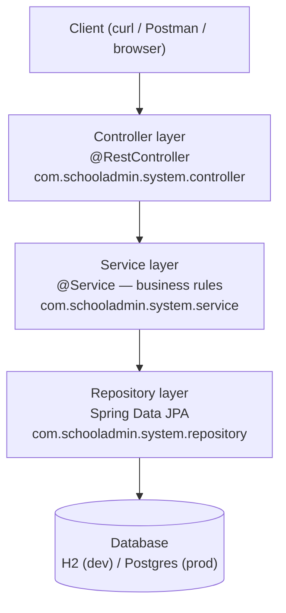
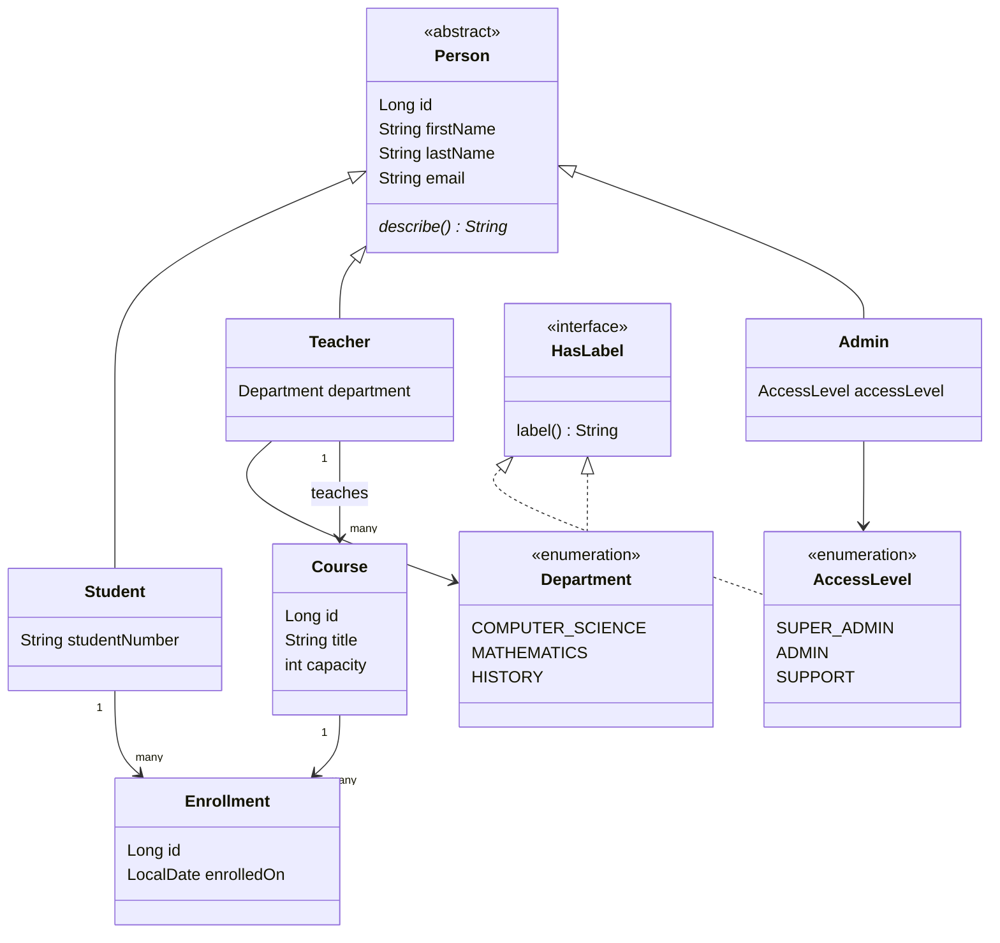
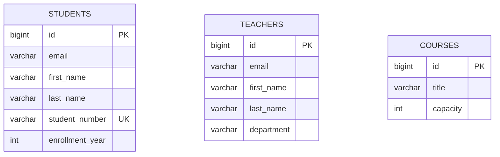

# Architecture

This document evolves as we build. Each diagram is dated with the roadmap module that
introduced or last changed it — don't expect this to be complete early on.

## Layered architecture (target shape)

As of Module 4, every layer shown here has real code in it, and the `Controller → Service`
arrow is real for all three resources: `StudentController`/`TeacherController`/
`CourseController` each call their own service (`StudentService`/`TeacherService`/
`CourseService`), never their repository directly. `StudentService` earned its place with a
real business rule (student-number generation); `Teacher`/`Course`'s services started out as
thin pass-throughs, added for **consistency** (uniform exception-throwing/handling across
all three) rather than an existing business rule of their own — a deliberate choice once the
question "should this be a service?" came up mid-module. Module 5 deepens all of this further
(`@Transactional`, the Strategy pattern) once `Course`/`Enrollment` relationships exist.

**Why layers?** Each layer has one job: Controllers translate HTTP ⇄ Java, Services hold
business rules, Repositories talk to the database. This keeps business logic testable
without spinning up a web server or a database (see Module 7). Package organization is
by-layer, not by-feature — reasoning in
[`notes/conventions.md`](notes/conventions.md#package-organization-by-layer-not-by-feature).

## Domain model (current shape from `java-refresher`, grows through Module 6)

_Enrollment is the join entity between Student and Course, introduced in Module 6. `Admin`,
`AccessLevel`, `Department`, and `HasLabel` reflect the actual code inherited from
[`java-refresher`](../java-refresher), not just a target — see that project's
`docs/notes/module-01-inheritance-polymorphism.md` and `docs/notes/module-02-enums.md`._

## Database schema (ER diagram, Module 2)

Generated automatically by Hibernate from `@Entity` classes at startup (`ddl-auto`,
Spring Boot's default for an in-memory database) — confirmed live via `spring.jpa.show-sql`,
not hand-drawn from a plan:

No relationships between these tables yet, on purpose — `Course` doesn't reference `Teacher`
or `Student` at the database level at all right now (matches the domain model diagram above,
which already plans `Enrollment` as the join entity connecting them; that's Module 6). `id`
on `Students`/`Teachers` comes from `Person`'s `@MappedSuperclass` fields, flattened into
each table directly — there's no `persons` table anywhere.

## Status log

- **Module 0:** project skeleton only, no Spring code yet. `Person`/`Student`/`Teacher`/
  `Admin` already exist as plain Java (no JPA annotations yet — those arrive in Module 2),
  along with `HasLabel`/`AccessLevel`/`Department` and the three custom exceptions —
  inherited as-is from the `java-refresher` project, where they were introduced and
  explained. `Course`/`Enrollment` and the layered architecture above are still target
  shape, not built yet.
- **Module 1:** the `service/` layer is real, not just target shape — `PersonService`
  (`@Service`, constructor-injected with a `List<Person>` bean) plus
  `PersonServiceStartupRunner` (`CommandLineRunner`), both confirmed live via
  `./mvnw spring-boot:run`. `controller/` and `repository/` were still target shape at this
  point — `repository/` became real in Module 2, `controller/` starts Module 3.
- **Module 2:** the `repository/` layer is real — `StudentRepository`, `TeacherRepository`,
  `CourseRepository`, all confirmed live (save/findById/derived query methods, real SQL in
  the logs). `Person` is `@MappedSuperclass`; `Student`/`Teacher`/`Course` are `@Entity`.
  `Course` is a genuinely new class, didn't exist before this module. `controller/` is still
  target shape — starts Module 3.
- **Module 3:** the `controller/` layer is real — full CRUD (`GET`/`POST`/`PUT`/`DELETE`)
  for all three resources, calling `repository/` directly (`service/` not yet in this path —
  see the note above the layered diagram). New `dto/` package: `StudentRequest`/
  `StudentResponse` and matching pairs for `Teacher`/`Course`, added after demonstrating
  live that returning/accepting entities directly let a `POST` silently overwrite an
  existing row by id.
- **Module 4:** the `Controller → Service` arrow is real for all three resources —
  `StudentService` (earlier than Module 5's planned service-layer introduction, kept small
  and deliberate) owns student-number generation and throws `StudentNotFoundException`;
  `TeacherService`/`CourseService` followed for consistency once the question "should this
  be a service?" came up mid-module, even though they started as thin pass-throughs with no
  business rule of their own yet. All three controllers now only do HTTP ⇄ Java translation.
  `GlobalExceptionHandler` (`@RestControllerAdvice`) applies to all three automatically, via
  one shared abstract `NotFoundException` base class (`StudentNotFoundException`/
  `TeacherNotFoundException`/`CourseNotFoundException` all extend it) rather than one
  handler method per resource. `studentNumber` changed from client-supplied to
  server-generated (a surrogate-key-vs-natural-key discussion — `id` and `studentNumber`
  are different kinds of identifier, not redundant).
