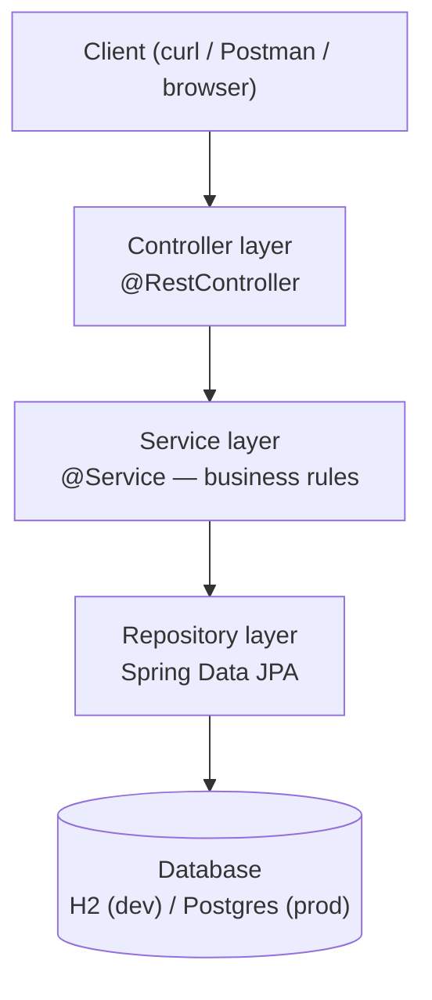
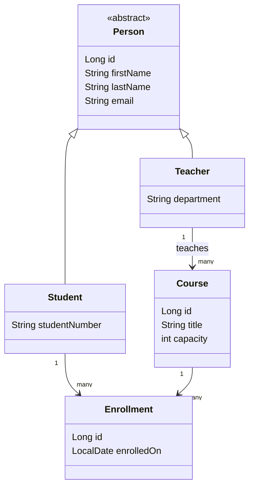

# Architecture

This document evolves as we build. Each diagram is dated with the roadmap module that
introduced or last changed it — don't expect this to be complete early on.

## Layered architecture (target shape)

This is where we're *heading* — not everything here exists yet. As of Module 0, only the
empty Spring Boot skeleton exists.

**Why layers?** Each layer has one job: Controllers translate HTTP ⇄ Java, Services hold
business rules, Repositories talk to the database. This keeps business logic testable
without spinning up a web server or a database (see Module 11).

## Domain model (target shape, grows through Modules 1–8)

_Enrollment is the join entity between Student and Course (introduced in Module 10)._

## Status log

- **Module 0:** project skeleton only, no code yet. Diagrams above are the target we're
  building toward, not current state.
