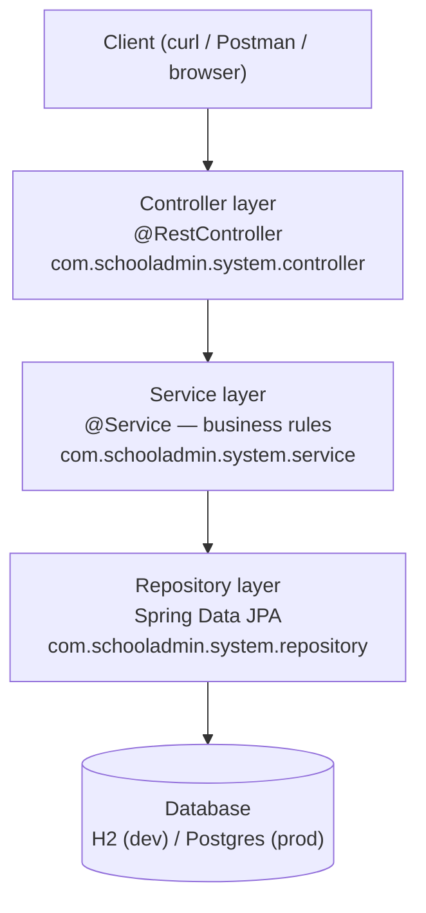
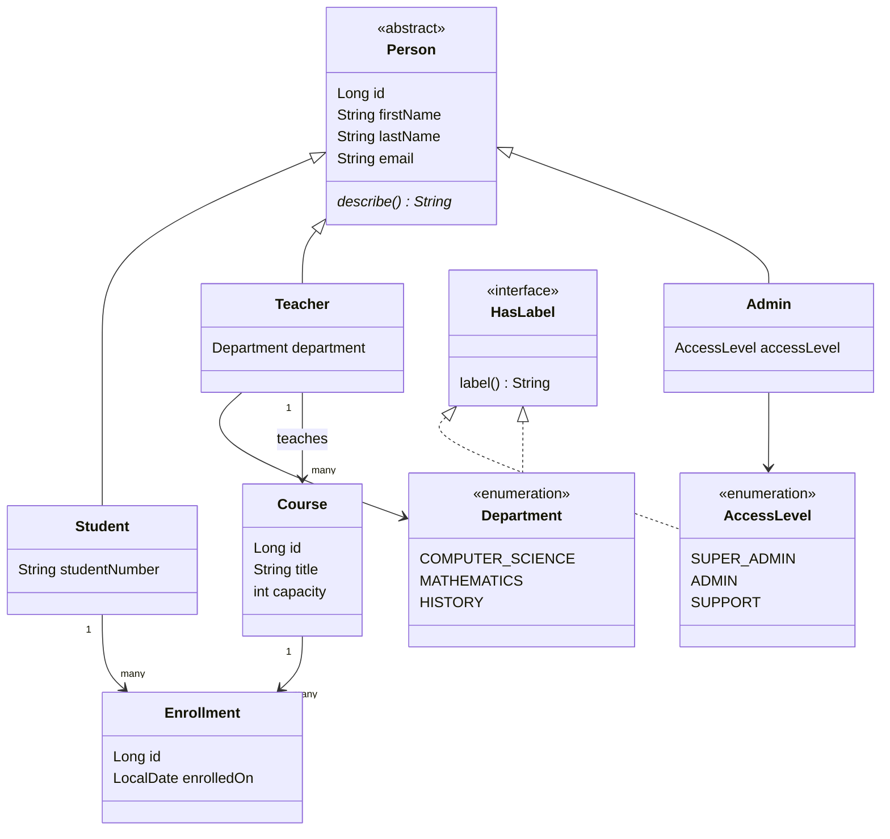

# Architecture

This document evolves as we build. Each diagram is dated with the roadmap module that
introduced or last changed it — don't expect this to be complete early on.

## Layered architecture (target shape)

This is where we're *heading* — not everything here exists yet. As of Module 0, only the
empty Spring Boot skeleton exists (plus the `domain/` classes inherited from the
[`java-refresher`](../java-refresher) project, which handled the core-Java modules).

**Why layers?** Each layer has one job: Controllers translate HTTP ⇄ Java, Services hold
business rules, Repositories talk to the database. This keeps business logic testable
without spinning up a web server or a database (see Module 7). Package organization is
by-layer, not by-feature — reasoning in
[`notes/conventions.md`](notes/conventions.md#package-organization-by-layer-not-by-feature).

## Domain model (current shape from `java-refresher`, grows through Module 6)

_Enrollment is the join entity between Student and Course, introduced in Module 6. `Admin`,
`AccessLevel`, `Department`, and `HasLabel` reflect the actual code inherited from
[`java-refresher`](../java-refresher), not just a target — see that project's
`docs/notes/module-01-inheritance-polymorphism.md` and `docs/notes/module-02-enums.md`._

## Status log

- **Module 0:** project skeleton only, no Spring code yet. `Person`/`Student`/`Teacher`/
  `Admin` already exist as plain Java (no JPA annotations yet — those arrive in Module 2),
  along with `HasLabel`/`AccessLevel`/`Department` and the three custom exceptions —
  inherited as-is from the `java-refresher` project, where they were introduced and
  explained. `Course`/`Enrollment` and the layered architecture above are still target
  shape, not built yet — that starts Module 1.
